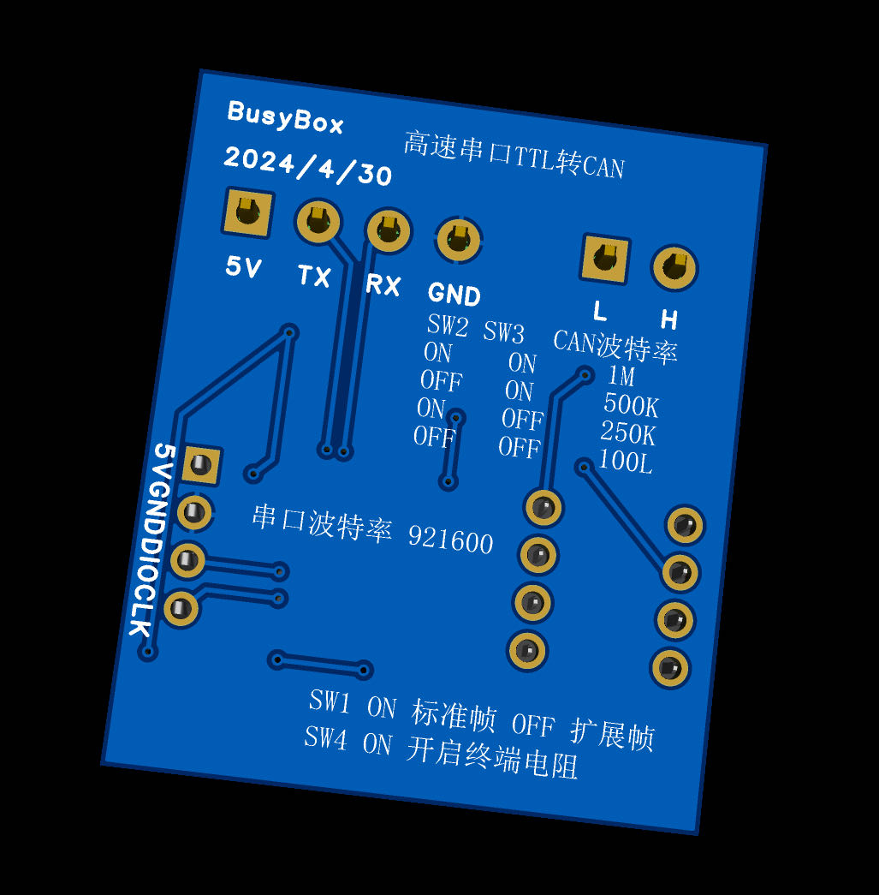
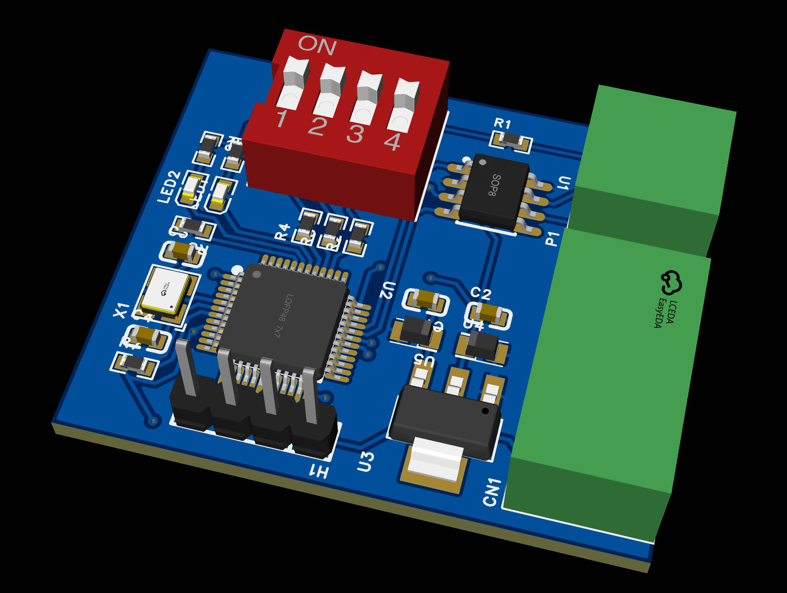

# 高速串口TTL转CAN




<table border = "2">
    <tr>
        <td>TTL串口波特率</td>
        <td>921600</td>
    </tr>
    <tr>
        <td>数据位</td>
        <td>8位</td>
    </tr>
    <tr>
        <td>停止位</td>
        <td>1位</td>
    </tr>
    <tr>
        <td>校验位</td>
        <td>无</td>
    </tr>
</table>

模块上4个拨码开关说明：

<table border = "2">
    <tr>
        <td>SW1</td>
        <td>帧格式</td>
    </tr>
    <tr>
        <td>ON</td>
        <td>标准帧</td>
    </tr>
    <tr>
        <td>OFF</td>
        <td>扩展帧</td>
    </tr>
</table>

 <table border="2" >
	<tr>
		<td>SW2</td>
		<td>SW3</td>
        <td>CAN波特率</td>
	</tr>
    <tr>
        <td>ON</td>
        <td>ON</td>
        <td>1M</td>
    </tr>
    <tr>
        <td>OFF</td>
        <td>ON</td>
        <td>500K</td>
    </tr>
    <tr>
        <td>ON</td>
        <td>OFF</td>
        <td>250K</td>
    </tr>
    <tr>
        <td>OFF</td>
        <td>OFF</td>
        <td>100K</td>
    </tr>
</table>

<table border = "2">
    <tr>
        <td>SW4</td>
        <td>终端电阻</td>
    </tr>
    <tr>
        <td>ON</td>
        <td>开启</td>
    </tr>
    <tr>
        <td>OFF</td>
        <td>关闭</td>
    </tr>
</table>

##参考文档

首先需要安装 https://github.com/ExceptionQWQ/RobotDevKit

```c++
enum class IDType:uint8_t
{
    STD = 0x01, //标准帧
    EXT = 0x02, //扩展帧
};

enum class FrameType:uint8_t
{
    Data = 0x01, //数据帧
    Remote = 0x02, //远程帧
};

struct FrameData
{
    uint8_t d0;
    uint8_t d1;
    uint8_t d2;
    uint8_t d3;
    uint8_t d4;
    uint8_t d5;
    uint8_t d6;
    uint8_t d7;
    uint8_t d8; //扩展帧使用
    uint8_t d9; //扩展帧使用
};

/*
 * @brief 串口转CAN构造函数
 * @param serial_port 串口指针
 * @param id_type 帧类型
 */
SerialToCan::SerialToCan(std::shared_ptr<SerialPort> serial_port, IDType id_type);
/*
 * @brief 异步写入帧数据
 * @param id 帧id
 * @param data 数据帧
 * @param result_handler 写入完成回调函数
 */
std::size_t async_write_frame(uint32_t id, FrameData data, ResultHandler result_handler);
/*
 * @brief 异步读取帧数据
 * @param id 帧id
 * @param data 数据帧
 * @param result_handler 读取完成回调函数
 */
std::size_t async_read_frame(uint32_t* id, FrameData* data, ResultHandler result_handler);

/*
 * @brief 写入帧数据
 * @param id 帧id
 * @param data 数据帧
 */
std::size_t write_frame(uint32_t id, FrameData data);
/*
 * @brief 读取帧数据
 * @param id 帧id
 * @param data 数据帧
 */
std::size_t read_frame(uint32_t* id, FrameData* data);

/*
 * @brief 写入帧数据
 * @param id 帧id
 * @param data 数据帧
 * @param timeout 超时时间
 */
std::size_t write_frame(uint32_t id, FrameData data, int timeout);

/*
 * @brief 读取帧数据
 * @param id 帧id
 * @param data 数据帧
 * @param timeout 超时时间
 */
std::size_t read_frame(uint32_t* id, FrameData* data, int timeout);
```

## 例程
Linux平台控制大疆M3508电机例程
```c++
/*
 * @author BusyBox
 * @date 2024/4/29
 * @version 1.0
 * @git https://github.com/ExceptionQWQ/RobotDevKit
 */

#include <iostream>
#include <cstring>
#include <memory>
#include "rdk/core.h"

int main()
{
    auto serial = std::make_shared<SerialPort>("/dev/serial/by-path/platform-fd500000.pcie-pci-0000:01:00.0-usb-0:1.1:1.0-port0", 921600);
    auto can = std::make_shared<SerialToCan>(serial, CanBus::IDType::STD);
    auto c6xx_controller = std::make_shared<C6xxController>(can);
    auto m3508_motor = std::make_shared<M3508Motor>(c6xx_controller, 1, DjiMotor::Mode::SPEED_POS); //创建id为1，模式为速度位置模式的电机对象

    m3508_motor->set_pos_pid(0.06, 0, 0.06); //设置位置式PID参数

    double angle = 0;
    int cnt = 0;
    while (true) {
        ++cnt;
    
        if (cnt % 800 == 0) {
            angle += 90;
        }
        m3508_motor->set_target_pos(angle);
        
        m3508_motor->tick();
        c6xx_controller->tick();
        
        std::cout << m3508_motor->get_pos() << std::endl;

        std::this_thread::sleep_for(std::chrono::milliseconds(1));
    }

    return 0;
}
```

Linux平台控制达妙电机例程
```c++
/*
 * @author BusyBox
 * @date 2024/4/29
 * @version 1.0
 * @git https://github.com/ExceptionQWQ/RobotDevKit
 */

#include <iostream>
#include <cstring>
#include <memory>
#include "rdk/core.h"

int main()
{
    auto serial = std::make_shared<SerialPort>("/dev/serial/by-path/platform-fd500000.pcie-pci-0000:01:00.0-usb-0:1.1:1.0-port0", 921600);
    auto can = std::make_shared<SerialToCan>(serial, CanBus::IDType::STD);
    auto damiao_controller = std::make_shared<DamiaoController>(can, DamiaoController::Mode::PosSpeed);

    damiao_controller->enable(1);  //电机使能

    while (true) {
        damiao_controller->write_pos_speed(1, 2 * 3.14, 9.14); //旋转一圈
        std::this_thread::sleep_for(std::chrono::milliseconds(1000));
        damiao_controller->write_pos_speed(1, 0, 9.14); //回到零点
        std::this_thread::sleep_for(std::chrono::milliseconds(1000));
    }

    return 0;
}
```